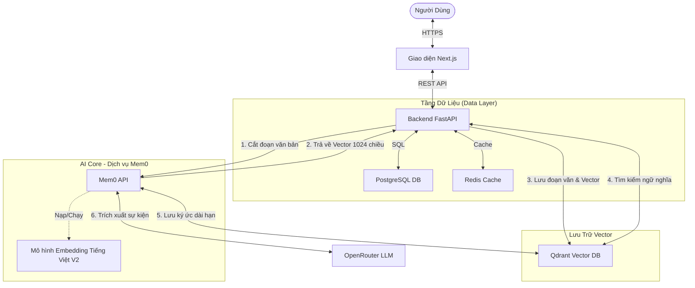

# Tổng Quan Kiến Trúc & Đánh Giá Chất Lượng Code ChatSNP

## 1. Tổng Quan Kiến Trúc Hệ Thống

Hệ thống ChatSNP tuân theo kiến trúc **Microservices-lite** (Hướng dịch vụ) sử dụng Docker Compose. Nó phân tách các chức năng thành các dịch vụ chuyên biệt, rõ ràng để đảm bảo khả năng mở rộng (scalability) và dễ bảo trì.

### Luồng Dữ Liệu (Data Flow)
1.  **Giao diện (Frontend - Next.js)** gửi tin nhắn của người dùng đến **Backend (FastAPI)**.
2.  **Backend** lưu tin nhắn vào **PostgreSQL** ngay lập tức và trả về `201 Created` cho người dùng (<200ms) để giao diện phản hồi mượt mà.
3.  **Tác vụ chạy ngầm (Background Tasks)** bắt đầu làm việc:
    -   **Cắt & Nhúng (Embedding):** Văn bản được chia nhỏ và gửi sang **Mem0 Service** (`/embed`) để biến thành Vector số học.
    -   **Lưu trữ ngắn hạn (Qdrant `chat_chunks`):**
        -   *Mục đích:* Lưu trữ **nguyên văn** đoạn hội thoại vừa diễn ra (Recall).
        -   *Tại sao dùng Qdrant trực tiếp?* Để tìm kiếm lại chính xác những gì người dùng vừa nói (Ví dụ: "Nãy tôi bảo sửa code ở dòng nào?").
    -   **Lưu ký ức dài hạn (Mem0 Service):**
        -   *Mục đích:* Lưu trữ **thông tin/sự kiện/sở thích** quan trọng (User Profile).
        -   *Tại sao dùng Mem0:* Mem0 không lưu nguyên văn câu nói. Nó dùng LLM để **tóm tắt & trích xuất** thông tin (Ví dụ: Người dùng nói "Tôi thích màu xanh", Mem0 sẽ lưu "User thích màu xanh"). Ký ức này sẽ tồn tại mãi mãi qua các phiên chat.
4.  **Truy vấn thông tin (RAG):** Khi người dùng đặt câu hỏi, Backend sẽ tìm kiếm song song ở cả **Qdrant** (ngắn hạn - chính xác) và **Mem0** (dài hạn - ngữ cảnh), gộp kết quả lại để LLM trả lời câu hỏi thông minh nhất.

### Chi Tiết Thành Phần (Component Breakdown)
-   **Frontend:** Next.js 15 (App Router), TypeScript, TailwindCSS. Sử dụng Server Actions để giao tiếp bảo mật với backend.
-   **Backend:** FastAPI (Python 3.11). Xử lý nghiệp vụ chính, xác thực người dùng và điều phối luồng dữ liệu.
-   **Mem0 Service:** Một dịch vụ riêng biệt bao gói thư viện `mem0`. Tập trung toàn bộ logic về Embedding (biến chữ thành số) và Quản lý ký ức dài hạn.
-   **Cơ sở dữ liệu (Databases):**
    -   **PostgreSQL:** Dữ liệu quan hệ (Người dùng, Phiên chat, Tin nhắn).
    -   **Redis:** Cache nóng cho lịch sử phiên chat (giúp đọc lại tin nhắn cũ cực nhanh).
    -   **Qdrant:** Vector database (Cơ sở dữ liệu vector) dùng cho tìm kiếm ngữ nghĩa.

---

## 2. Đánh Giá Chất Lượng Code ("Tại sao nó ngon?")

### ✅ 1. Thiết Kế Ưu Tiên Hiệu Năng (Performance-First)
-   **Xử lý Bất Đồng Bộ (Async):** Việc tối ưu hóa gần đây đã chuyển toàn bộ các tác vụ nặng (nhúng vector, trích xuất ký ức) vào **Background Tasks**. Điều này giữ cho API phản hồi cực nhanh.
-   **Thực Thi Song Song:** Hàm `semantic_search` truy vấn nhiều nguồn dữ liệu (Qdrant, Mem0) cùng một lúc bằng `asyncio.gather`, thay vì chờ đợi tuần tự.
-   **Caching Thông Minh:** Redis được dùng để cache lịch sử phiên chat, giảm tải đáng kể cho PostgreSQL.

### ✅ 2. Module Hóa & Tách Biệt (Modular & Decoupled)
-   **Tách Biệt Service:** Backend không cần biết *làm thế nào* để nhúng văn bản hay lưu ký ức; nó chỉ cần ra lệnh cho **Mem0 Service**. Nghĩa là sau này bạn có thể nâng cấp model AI hay logic bộ nhớ mà không cần chạm vào code lõi của Backend.
-   **Dependency Injection:** Backend sử dụng `Depends()` của FastAPI để quản lý kết nối database và cấu hình, giúp code dễ đọc, dễ test và bảo trì.

### ✅ 3. An Toàn Kiểu & Bền Vững (Type Safety & Robustness)
-   **Cơ Chế Thử Lại (Retry Mechanism):** Các tác vụ ngầm (lưu vector, trích xuất ký ức) được bảo vệ bởi thư viện `tenacity`. Nếu mạng chập chờn hoặc API lỗi, hệ thống sẽ tự động thử lại (Exponential Backoff) để đảm bảo không mất dữ liệu.
-   **Pydantic Models:** Mọi dữ liệu đi vào và đi ra khỏi API đều được kiểm tra (validate) chặt chẽ. Sai kiểu dữ liệu là báo lỗi ngay, không gây crash ngầm.
-   **TypeScript:** Frontend được định kiểu toàn bộ, ngăn chặn các lỗi ngớ ngẩn thường gặp khi chạy (runtime errors).
-   **Xử Lý Lỗi Toàn Cục:** Một bộ xử lý ngoại lệ trung tâm đảm bảo các headers quan trọng (như CORS) luôn được trả về, giúp Frontend không bị "sập" kể cả khi Backend gặp lỗi nặng (500 Error).

### ✅ 4. Tối Ưu Chi Phí & Tài Nguyên
-   **Bộ Lọc Thông Minh:** Hệ thống chỉ gửi tin nhắn có nội dung đáng kể (> 10 ký tự) sang Mem0 để trích xuất ký ức. Các câu chào hỏi xã giao ("Hello", "OK") bị loại bỏ để tiết kiệm Token và giảm độ trễ.

### ⚠️ Điểm Cần Cải Thiện (Cho Production)
-   **Bảo mật:** Cần triển khai HTTPS và cấu hình CORS chặt chẽ hơn (chỉ cho phép domain thật sự thay vì `*`).
-   **Giám sát (Observability):** Nên thêm hệ thống log tập trung (như ELK hoặc Prometheus) để dễ dàng debug các lỗi phát sinh trên môi trường thật.

---

## 3. Sơ Đồ Kiến Trúc (Mermaid Diagram)

## 4. Lớp Embedding (Chuyên Gia Tiếng Việt)

Hệ thống sử dụng một mô hình Embedding chuyên dụng, được tối ưu hóa riêng cho Tiếng Việt. Đây là thành phần cốt lõi giúp tính năng tìm kiếm ngữ nghĩa hoạt động chính xác tại thị trường Việt Nam.

-   **Mô hình:** [`thanhtantran/Vietnamese_Embedding_v2`](https://huggingface.co/thanhtantran/Vietnamese_Embedding_v2)
-   **Loại:** Sentence Transformer (Hugging Face)
-   **Số chiều:** `1024` (Độ chính xác cao)
-   **Triển khai:**
    -   **Nơi chứa:** Container **Mem0 Service**.
    -   **Cơ chế:** Mô hình được tải về **một lần duy nhất** vào thư mục `/root/.cache/huggingface` (được lưu bền vững qua Docker Volume). Mỗi lần khởi động lại, nó được nạp thẳng vào RAM (~2GB) từ ổ cứng, không cần tải lại từ mạng.
    -   **API nội bộ:** Được Mem0 Service mở ra qua `POST /embed`, giúp Backend không cần tốn tài nguyên tải model này.

### Cơ chế hoạt động (Tại sao nó hiểu được tiếng Việt?)
Khác với tìm kiếm từ khóa thông thường (phải khớp từng chữ, ví dụ tìm "Ngân hàng" thì phải có chữ "Ngân hàng"), mô hình này hiểu được **ý nghĩa**:

1.  **Tokenization (Tách từ):** Câu văn (ví dụ "Thủ đô của Việt Nam") được tách thành các đơn vị từ ngữ mà máy hiểu được.
2.  **Biến đổi Vector:** Các từ này đi qua mạng neuron (Transformer) đã được học hàng triệu văn bản tiếng Việt. Máy sẽ biến câu văn thành một **Vector 1024 chiều** (một dãy 1024 con số).
3.  **So sánh ngữ nghĩa:**
    -   Trong không gian toán học này, vector của "Hà Nội" và "Thủ đô" sẽ nằm rất gần nhau (tương đồng cao).
    -   Vector của "Con mèo" sẽ nằm rất xa.
    -   Nhờ đó, khi tìm "Thủ đô nước ta là gì", hệ thống sẽ lôi được đoạn văn "Hà Nội là trung tâm chính trị..." ra để trả lời, dù không hề trùng khớp từ khóa.
